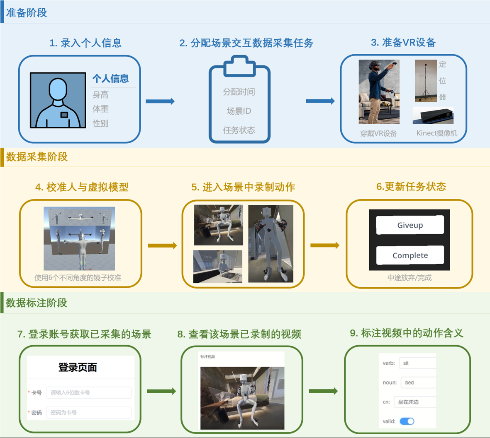
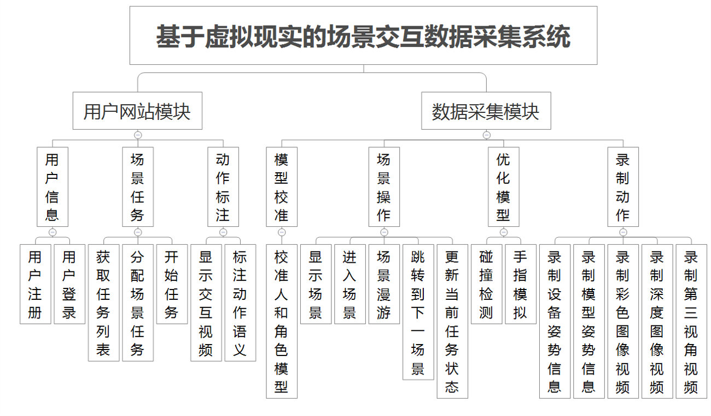
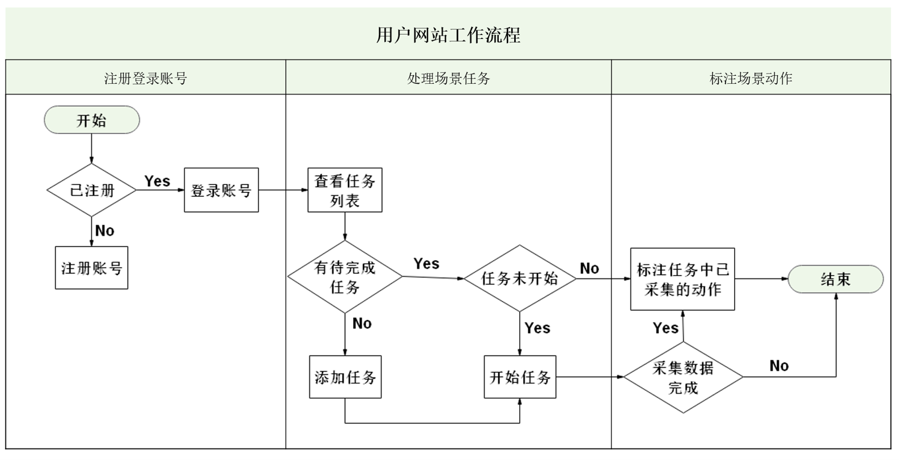
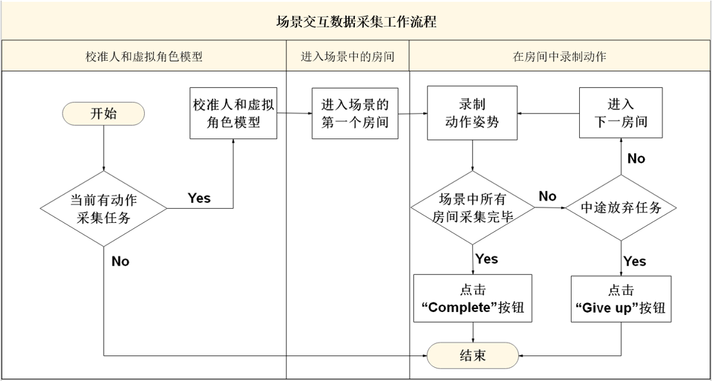

# InteractionCapture
目前，在室内场景中人与场景交互的数据不足，而且在真实场景中，捕捉人和场景交互的动作姿势面临很大挑战。我们使用虚拟的场景数据集，构建一个场景交互数据采集系统。传统人与场景交互的场景数量是12个，该系统使用的虚拟场景数量达到90个。另外，基于VR设备可以便捷地转移人到不同场景，跟在真实场景中捕捉数据相比，效率提升明显。

## 1. 系统流程
本系统将数据采集分成三个阶段，分别是采集准备阶段、数据采集阶段和数据标注阶段。

**阶段1：采集准备阶段**

为了让确保数据采集流程的通畅，我们需要先录入测试者的个人信息、为测试者分配具体的场景采集任务、穿戴好VR设备以及安装相关的设备。
* 个人信息：初次进行数据采集时，实现对测试者个人信息的录入以及存储；
* 分配任务：当测试者准备进行场景交互数据采集前，为其分配具体的场景。对自动分配场景任务，需要考虑现实意外情况和场景交互数据采集的丰富度，使得场景人物不出现分配的冲突情况，又能使得采集到的结果数据集更好；
* 准备采集数据的设备：在采集数据前，需要佩戴VR设备、安装好定位器用于识别VR头显，以及安装Kinect体感摄像机，用于拍摄测试者的彩色图像视频和深度图像视频。

**阶段2：数据采集阶段**

在数据采集阶段，我们需要先校准人和虚拟角色模型来确保姿势信息的采集准确度，并且在采集时实现录制动作和更新任务状态。
* 校准人与虚拟角色模型：由于现实中人的身高、体重、性别差异，我们需要对每个测试者进行与虚拟角色模型的校准，使得虚拟现实场景中测试者和虚拟角色模型的身体和手指是贴合的，这样能提高测试者的姿势信息的采集准确度；
* 在场景中录制动作：这部分包括四个功能实现，分别为显示场景、自动将虚拟角色模型放置到分配的场景中、跳转到下一个场景、录制动作。其中，对于显示场景，我们需要实现室内场景数据集的读取，使其在开发引擎中正常显示；
* 更新任务状态：为了保证采集数据的有效性，当采集过程中出现意外情况，需要及时更新任务状态，以确保结果数据集中不出现无效的交互数据。

**阶段3：数据标注阶段**

为了让计算机能理解场景交互，我们需要对交互动作进行标注，明确动作姿势的具体含义。标注阶段的功能需求包括以下三部分：
* 获取已采集的场景：对每个测试者，需要为其构建一个任务列表，任务列表显示具体的场景任务和任务状态，测试者可以根据任务状态，分辨是否为已采集的场景，方便后续为已采集的场景数据进行标注；
* 查看该场景已录制的视频：对于已采集的场景，我们需要对应地显示录制的第三人称视角视频，方便测试者回忆已捕捉的动作姿势；
* 标注视频中的动作含义：每个动作对应的动作类型以及动作的作用对象是我们需要标注的，另外，我们还需要考虑该录制的动作是否有效。

## 2. 系统功能模块设计
系统的功能模块设计可以分为两个部分，分别为用户网站模块和数据采集模块，每个模块的具体功能如图所示。

### 2.1 用户网站模块设计
用户网站的功能主要包括处理用户注册、登录，以及处理场景任务和进行动作标注，网站的工作流程如图所示。

### 2.2 数据采集模块设计
数据采集应用的功能主要包括校准人和虚拟角色模型、进入场景中的房间、在房间中录制动作。场景交互数据采集应用的工作流程如图所示。

